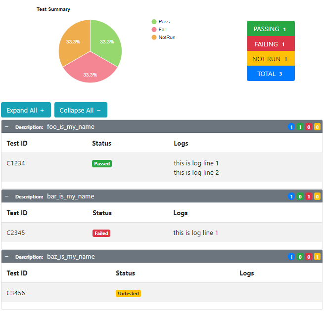

# AFT-Logging-HTML
an Automated Functional Testing (AFT) library providing logging to an HTML file for any `TestResult` objects logged via the `aft-core.LogManager`

## Installation
`> npm i aft-logging-html`

## Configuration
to specify the filename and output directory for the generated HTML results add the following to your `aftconfig.json`:
```json
{
  "LogManager": {
    "level": "info",
    "plugins": [
      {
        "name": "html-logging-plugin",
        "searchDirectory": "./node_modules/",
        "options": {
          "enabled": true,
          "level": "warn",
          "fileName": "TestResultsSummary.html",
          "outputDir": "./dist",
          "maxLogLines": 4
        }
      }
    ]
  }
}
```
- **level** - an optional `string` containing the `LogLevel` to be used in capturing logs _(defaults to value set for `LogManager`)_
- **fileName** - a `string` containing the full file name to write results into _(defaults to `testresults.html`)_
- **outputDir** - a `string` containing either a relative path from the current execution directory or an absolute path to where the results file will be written _(defaults to `process.cwd()`)_
- **maxLogLines** - a `number` indicating how many previous calls to the `log` method will be tracked. numbers greater than this will be discarded from the results _(defaults to `5`)_

> NOTE: any of the above `string` configuration values may be set to read from environment variables by setting their value to the name of the environment variable surrounded by `%` like `"fileName": "%JENKINS_ARTEFACTS_DIR%"` which would read from an environment variable named `JENKINS_ARTEFACTS_DIR`

## Example Report
the report generated by this plugin displays the description passed to your `Verifier` or `verify` function via the `Verifier.withDescription` function followed by any test ID passed in via the `Verifier.withTestId` function and the last 5 log lines for each test result
[](./src/templates/tmp.html)
