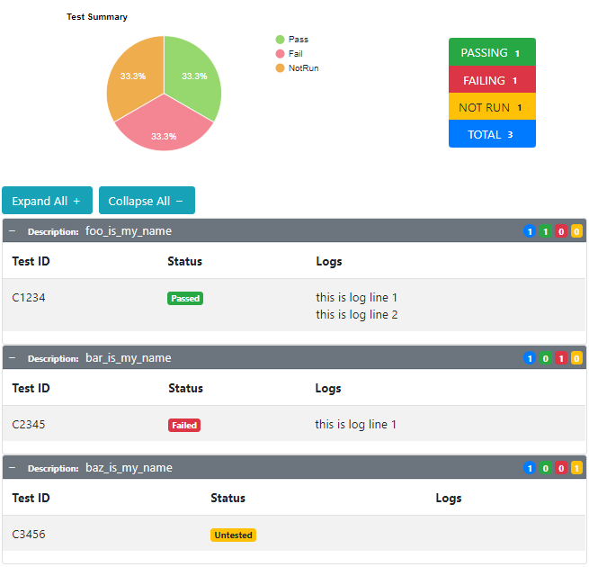

# AFT-reporting-HTML
an Automated Functional Testing (AFT) library providing logging to an HTML file for any `TestResult` objects logged via the `aft-core.ReportingManager`

## Installation
`> npm i aft-reporting-html`

## Configuration
to specify the filename and output directory for the generated HTML results add the following to your `aftconfig.json`:
```json
{
    "plugins": [
      {"name": "html-reporting-plugin", "searchDir": "./node_modules/"}
    ],
    "HtmlReportingPluginConfig": {
        "fileName": "testresults.html",
        "outputDir": "./logs",
        "maxLogLines": 5,
        "logLevel": "warn"
    }
}
```
- **logLevel** - an optional `string` containing the `LogLevel` to be used in capturing logs _(defaults to `warn`)_
- **fileName** - a `string` containing the full file name to write results into _(defaults to `testresults.html`)_
- **outputDir** - a `string` containing either a relative path from the current execution directory or an absolute path to where the results file will be written _(defaults to `path.join(process.cwd(), 'logs')`)_
- **maxLogLines** - a `number` indicating how many previous calls to the `log` method will be tracked. numbers greater than this will be discarded from the results _(defaults to `5`)_

#### NOTE:
> any of the above `string` configuration values may be set to read from environment variables by setting their value to the name of the environment variable surrounded by `%` like `"outputDir": "%JENKINS_ARTEFACTS_DIR%"` which would read from an environment variable named `JENKINS_ARTEFACTS_DIR`

## Example Report
the report generated by this plugin displays the description passed to your `AftTest` class or `aftTest` function via the `description` argument followed by any test ID included in the `description` or passed in via the `AftTestOptions.testIds` array and the last 5 log lines for each test result
[](./src/templates/tmp.html)
