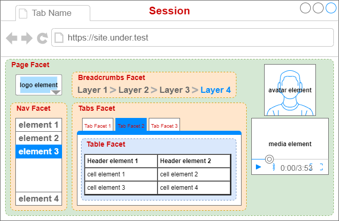

# AFT-UI-SELENIUM
Automated Functional Testing (AFT) package providing Selenium-based `SeleniumComponent extends UiComponent` class for use with POM-based UI testing strategies as well as `UiSessionGeneratorPlugin` implementations for connecting to Selenium via a Grid or Locally.

## Installation
`> npm i aft-ui-selenium`

## Page Object Model (POM)
the POM is a standard design pattern used in UI and layout testing. AFT-UI-SELENIUM supports this model via _Components_ where the _Component_ class is an object extending from `SeleniumComponent` and is responsible for interacting with the UI in a structured way. For example:

The above would use a POM design like:

**Session** - `Selenium.WebDriver`
- **Page Facet** - `SeleniumComponent`
  - _logo element_ - `WebElement`
  - **Breadcrumbs Facet** - `SeleniumComponent`
    - _breadcrumb links_ - `WebElement[]`
  - _avatar element_ - `WebElement`
  - **Nav Facet** - `SeleniumComponent`
    - _nav elements_ - `WebElement[]`
  - **Tabs Facet** - `SeleniumComponent`
    - **Tab Facet 1** - `SeleniumComponent`
    - **Tab Facet 2** - `SeleniumComponent`
      - **Table Facet** - `SeleniumComponent`
        - _header elements_ - `WebElement[]`
        - _cell elements_ - `WebElement[]`
    - **Tab Facet 3** - `SeleniumComponent`
  - _media element_ - `WebElement`

## Creating your own Components for use in testing
Take the following as an example of how one could interact with the following page https://the-internet.herokuapp.com/login

### Step 1: create the Page Component

```typescript
/**
 * represents the login page object containing widgets encapsulating
 * the functionality of the website
 */
export class HerokuLoginPage extends SeleniumComponent {
    /* the locator can also be specified in options */
    override get locator(): Locator { return By.css('html'); }
    /* components contained in this page */
    private get content() { return this.getComponent(HerokuContentComponent); }
    private get messages() { return this.getComponent(HerokuMessagesComponent); }
    async navigateTo(): Promise<void> {
        await this.driver.navigate().to('https://the-internet.herokuapp.com/login');
    }
    /* action functions */
    async login(user: string, pass: string): Promise<void> {
        await this.content.login(user, pass);
    }
    async hasMessage(): Promise<boolean> {
        return await this.messages.hasMessage();
    }
    async getMessage(): Promise<string> {
        return await this.messages.getMessage();
    }
}
```

### Step 2: create the content and messages Facets

```typescript
/**
 * represents the content of the login page including the 
 * username and password fields and the login button
 */
export class HerokuContentComponent extends SeleniumComponent {
    readonly locator: Locator = By.id("content");
    /**
     * get Component's root element (`root`) using
     * the Component.locator and then call 
     * `root.findElement(By.id("username"))` from that
     */
    private get usernameInput() { return this.getRoot().then(r => r.findElement(By.id("username"))); }
    private get passwordInput() { return this.getRoot().then(r => r.findElement(By.id("password"))); }
    private get loginButton() { return this.getRoot().then(r => r.findElement(By.css("button.radius"))); }
    /* action functions */
    async login(user: string, pass: string): Promise<void> {
        await this.usernameInput.then(input => input.sendKeys(user));
        await this.passwordInput.then(input => input.sendKeys(pass));
        return await this.clickLoginButton();
    }
    async clickLoginButton(): Promise<void> {
        await this.loginButton.then(button => button.click());
    }
}
```
```typescript
/**
 * represents the results message content shown on successful 
 * or failed login.
 */
export class HerokuMessagesComponent extends SeleniumComponent {
    readonly locator: Locator = By.id("flash-messages");
    private get message() { return this.getRoot().then(r => r.findElement(By.id("flash")); }
    /* action functions */
    async hasMessage(): Promise<boolean> {
        return await this.message
            .then((message) => {
                return message !== undefined;
            }).catch((err: Error) => {
                return false;
            });
    }
    async getMessage(): Promise<string> {
        if (await this.hasMessage()) {
            return await this.message.then(m => m.getText());
        }
        return null;
    }
}
```
### Step 3: use them to interact with the web application

```typescript
await verifyWithSelenium(async (v: SeleniumVerifier) => {
    let loginPage: HerokuLoginPage = v.getComponent(HerokuLoginPage);
    await v.reporter.step('navigate to LoginPage...');
    await loginPage.navigateTo();
    await v.reporter.step('login');
    await loginPage.login("tomsmith", "SuperSecretPassword!");
    await v.reporter.step('wait for message to appear...')
    await retry(() => loginPage.hasMessage())
        .until((res) => res === true)
        .withMaxDuration(20000); // 20 seconds
    await v.reporter.step('get message...');
    return await loginPage.getMessage();
}).withDescription('can access websites using AFT and Page Widgets and Facets')
    .and.withTestIds('C3456', 'C2345', 'C1234')
    .returns("You logged into a secure area!");
```
